# Как я перестал бояться и полюбил Elementary

Elementary OS - проект дистрибутива на базе Ubuntu, который с выхода первой версии окрестили "очередным клоном макоси". При этом, уникальные фишки дистрибутива (которых было очень много, начиная от самописной DE, заканчивая целыми стайлгайдами для стороннего софта) доморощенные эксперты с линуксфорумов не замечали, поскольку, чаще всего, и не устанавливали дистрибутив. По этой причине Elementary осталась незаслуженно малоизвестной - и выход новой версии ожидала лишь небольшая группа поклонников.

Я ставил примерно год назад прошлую версию, Luna. Увы, багов в ней было слишком много, и я через три дня вынужден был переехать обратно на Arch. Впрочем, уже тогда Luna считалась устаревшей, и сообщество фанатов ждало новую версию дистрибутива - изначально названную Isis, потом переименованную во Freya из-за схожести прошлого названия с англоязычным наименованием ИГИЛ. Прошло почти два года, свет увидели две бета-версии и один скандал, связанный с тем, что [разработчики назвали бесплатное скачивание дистрибутива читерством](http://www.reddit.com/r/elementaryos/comments/2vk5ba/elementary_os_devs_say_youre_cheating_if_you_dont/). 11 апреля новая версия увидела свет - в этот же день я её поставил, увы, не заплатив ни доллара разработчикам. Прошло две с половиной недели - и я понял, что никуда отсюда уже не переберусь.

## Установка и первый запуск

Скачать Elementary можно с [официального сайта](http://elementary.io). При этом, вас ожидает одна подлянка - если просто нажать кнопку "Скачать", то разработчики предложат вам заплатить 25 долларов.

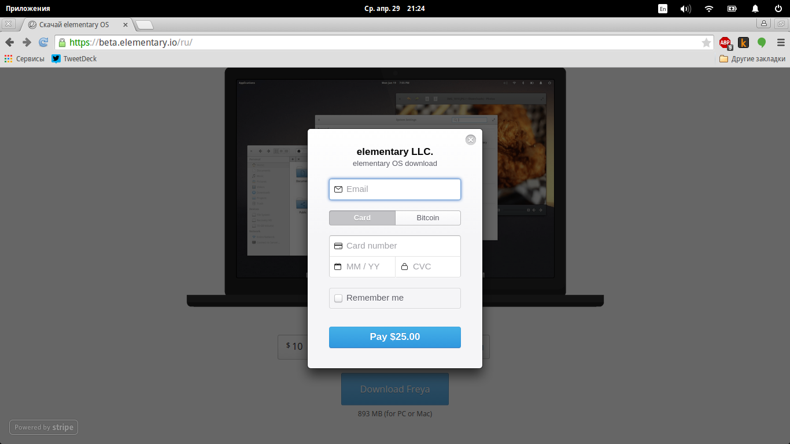

Обходится это достаточно просто: на главном сайте есть кнопка "Другая сумма", где можно указать 0, и тогда дистрибутив скачается бесплатно. ISO весит примерно 900 мегабайт, спокойно записывается на любую флэшку (для пользователей Windows рекомендую [Linux Live USB Creator](http://www.linuxliveusb.com/
)). Установка один в один схожа с установкой Ubuntu 14.04 - если вы в первый раз ставите Linux, следуйте [официальному гайду](http://www.ubuntu.com/download/desktop/install-ubuntu-desktop).

Вот что мы увидим после установки и первой загрузки:

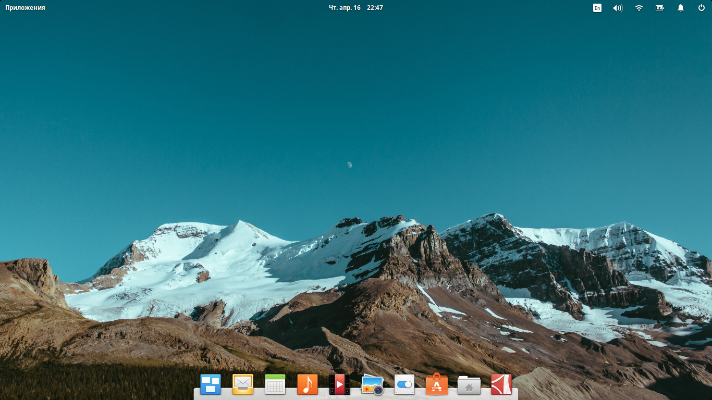

Да, это действительно отдалённо напоминает Mac OS X. Хотя, мне внешний вид дистрибутива более напоминает Gnome 3 с доком внизу. Но стоит открыть любое окно, хотя бы файловый менеджер - как первое впечатление рассеивается: это и похоже на Mac OS X, и одновременно совсем не похоже.

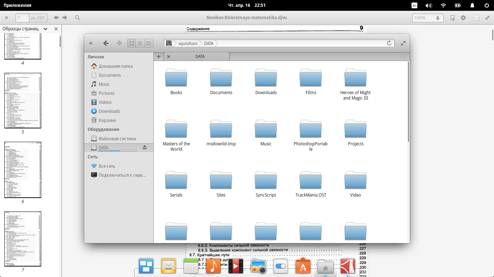

В первую очередь, выделяется отстутствие глобального меню. Как и вообще какого-либо меню. Разработчики Elementary придерживаются своей концепции внешнего вида приложений - она очень схожа с концепцией минимализма во всём. У файлового менеджера, например, настроек нет вообще, у музыкального плеера (как мы увидим позже) - лишь настройка папки с музыкой и интеграция с Last.FM.

При этом, нельзя сказать, чтобы стандартные приложения были нефункциональны - и в файловом менеджере, и в музыкальном плеере есть всё необходимое. Настройки же доступны в одном глобальном центре - почти всё, что входит в состав рабочего окружения, настраивается через Центр управления. Но при этом разнообразие доступных изменений удручает.

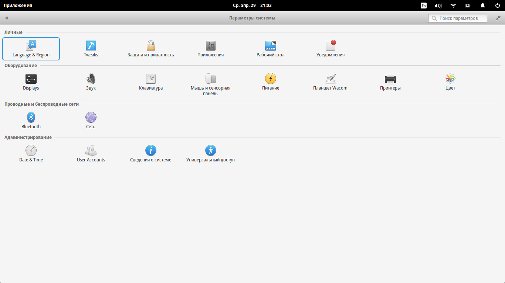

Ситуацию немного исправляет Elementary Tweaks - дополнительная панель настроек, встраиваемая в уже существующую панель. В ней можно найти и настройки дока (кстати, он называется Plank), и настройки файлового менеджера. [Метод установки](http://lmelinux.net/elementary-tweaks/), правда, предполагает, что вы умеете работать с консолью - если не умеете, то придется довольствоваться тем, что за вас настроили разработчики. Благо, настроено всё очень красиво и удобно.

Кстати, о консоли. Сразу после релиза обнаружилось, что в релизе пристутствует глюк с сменой раскладки клавиатуры по привычным нам сочетаниям - точнее, при попытке настроить своё сочетание [на свете умирал один лепрекон](http://elementary.today/forum/viewtopic.php?id=671). Глюк тянется ещё с беты, на момент написания статьи его должны были уже закрыть, но если нет - вот [инструкция](http://blog.elementary.today/post/115427577726/launchpad#notes), как его починить. Опять из консоли.

## Стандартные приложения

Стоит отметить, что Elementary поставляется не только с собственной графической оболочкой Pantheon, но и с собственными приложениями. Причём, приложения написаны специально под Elementary - а приложения под Elementary пишутся не так, как привычные нам приложения под Linux, вроде Firefox или LibreOffice.

Для разработки приложений на Elementatry используется язык программирования Vala, фреймворк GTK+ 3 и собственная библиотека под названием Granite. Кроме того, приложение должно удовлетворять []рекомедациям разработчиков](https://elementary.io/ru/docs/human-interface-guidelines/design-philosophy) - в результате, все приложения в Elementary довольно похожи и спроектированы с учётом одной философии. Для примера, рассмотрим e-mail клиент:

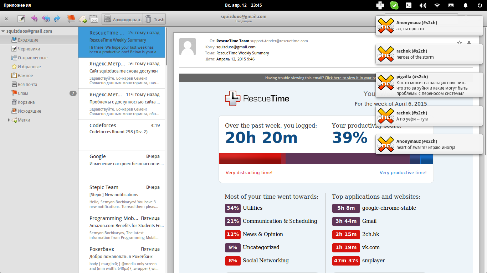

Как мы видим, интерфейс предельно прост и понятен. Слева папки почтового ящика, справа от папок - список писем в папке, ещё правее само письмо. Кнопки для управления - вверху, справа полоса поиска (её не видно за уведомлениями). Кстати, он очень сильно напоминает почтовый клиент в Mac OS X - но дьявол кроется в мелочах.

Стандартный клиент умеет работать только с IMAP-почтовыми ящиками. Из коробки доступна автоматическая настройка для GMail, Outlook и Yahoo. Но при этом, клиент работает идеально - за две с половиной недели ни единого вылета, ни единого глюка, даже ни единого случая, когда не было понятно, как сделать то или иное действие. Это дорогого стоит, стоит заметить - я не смог осилить почтовый клиент ни в KDE, ни в XFCE, ни хваленый Thunderbird, ни консольный mutt. А этот осилил и использую с удовольствием.

Если в почтовом клиенте можно было пожаловаться на недостаток функциональности (например, отсутствие поддержки POP3), то текстовый редактор в Elementary даже излишне функционален. Он умеет подсвечивать синтаксис, автоматически отправлять набранный текст по электронной почте и Bluetooth - ради примера, я писал в нём лабораторную работу по ОС, и текстовый редактор вполне справился со своей ролью. А ещё он умеет делить экран пополам - так что, при желании, его можно использовать как очень спартанскую IDE.

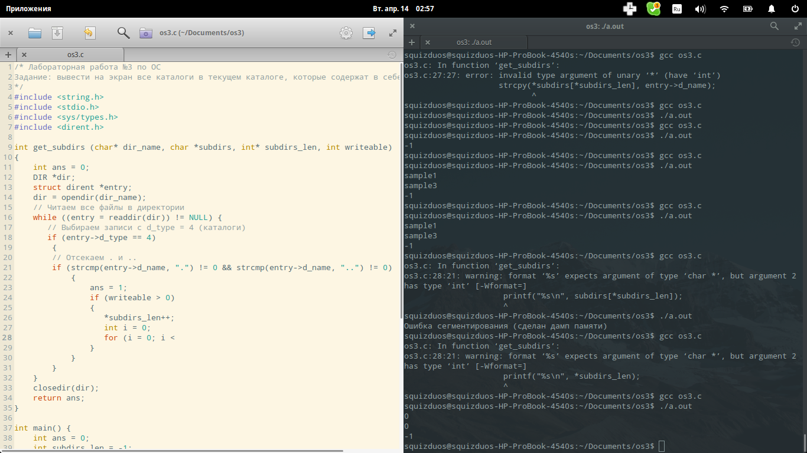

В комплекте также идёт программа для просмотра документов в формате PDF и DJVU. Опять же, продвинутых настроек в ней нет, но с задачей открытия и просмотра файлов справляется на 100%.

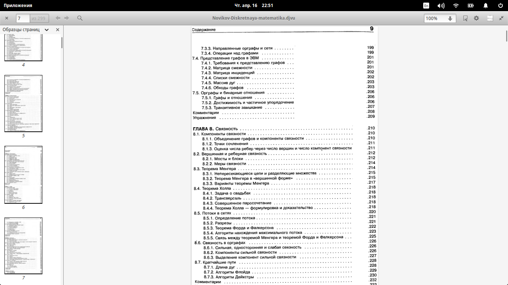

Музыкальный плеер, идущий в комплекте, с первого взгляда кажется спартанским (ну или клоном iTunes). Есть библиотека, есть полоса воспроизведения, есть поддержка хоткеев, казалось бы, что ещё надо для счастья? Редактирование тегов и интеграция с Last.FM - и то, и другое, в плеере есть, хоть и запрятано в дебри настроек. Юникодные теги плеер переварил без проблем.

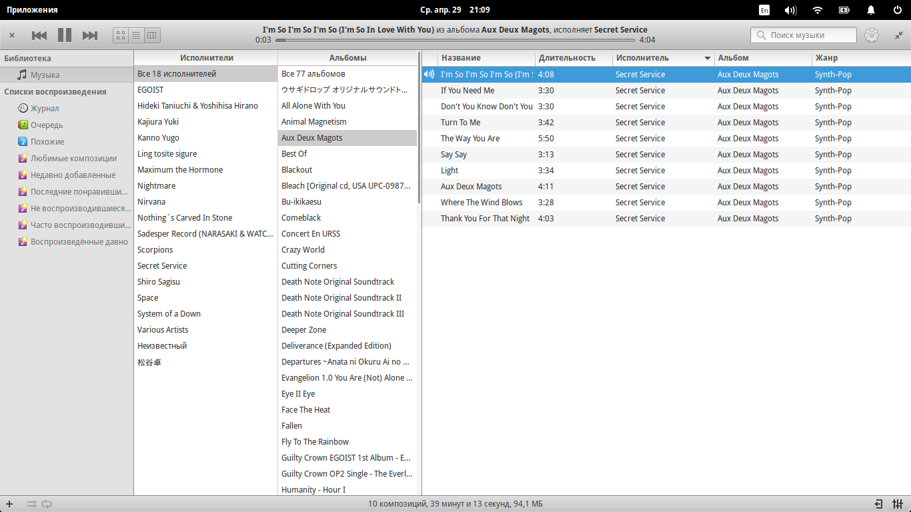

Осталось рассмотреть самое главное приложение для любого линукса - эмулятор терминала. Он довольно легковесен, поддерживает вкладки, глобальный поиск по содержимому. Однако, у него есть ещё одна "фича" - если вы вставляете команду, которая требует прав рута, то терминал вас об этом предупредит и заставит подтвердить, что вы действительно этого хотите. С одной стороны, это можно воспринимать, как защиту от ["патча Бармина"](lurkmore.to/rm_-rf), с другой - оно довольно сильно раздражает.

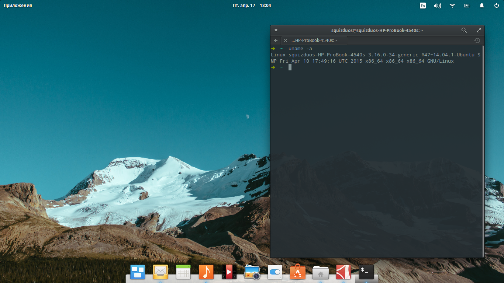

Видеоплеер ничем не выделяется, кроме довольно красивой "фичи" в виде живого превью фрагментов видео. Стандартная программа просмотра картинок умеет осуществлять базовые операции с изображениями - на этом её ценность для пользователя заканчивается.

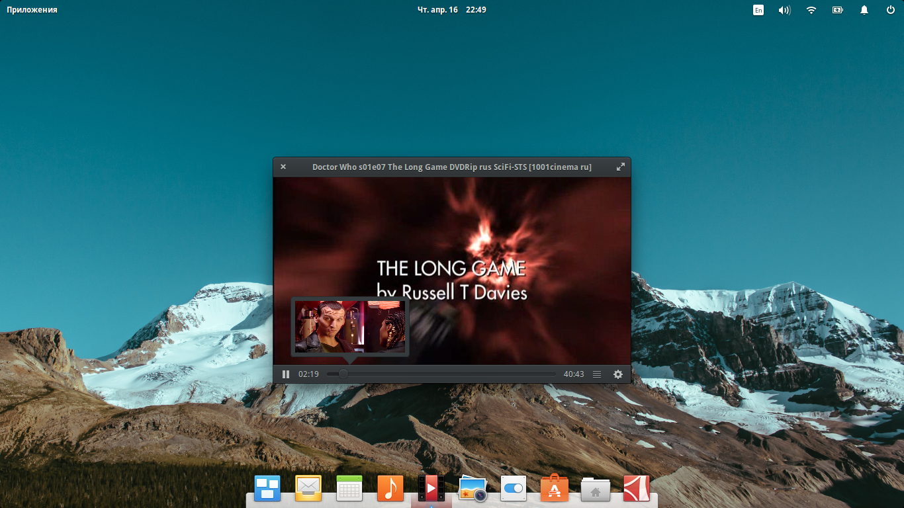

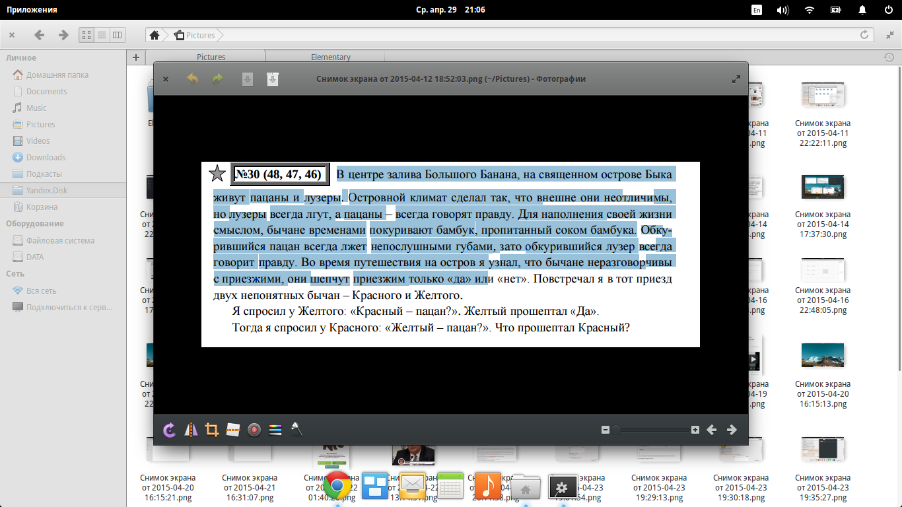

Ах да, ещё переключение рабочих столов (оно производится по клику мыши в терминале или хоткею Ctrl+1,2) выглядит очень красиво.

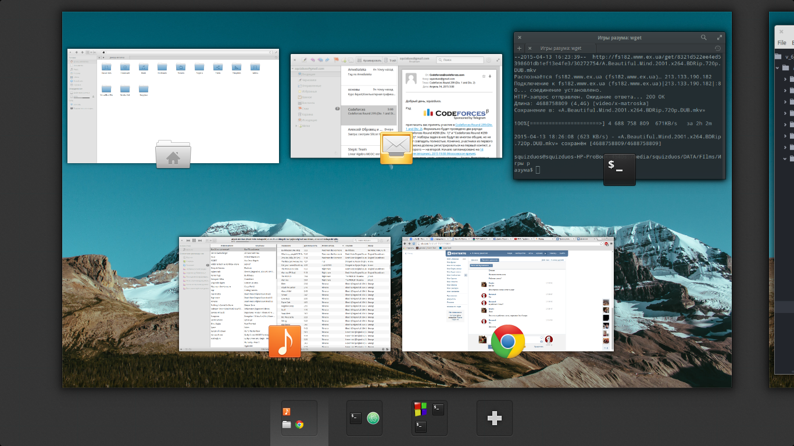

## Дистриубтив в работе

Красивости красивостями, но основное, что волновало меня - насколько дистрибутив пригоден к реальной работе? У Luna с этим были серьёзные проблемы - устаревшие версии библиотек и программ удовольствия никогда не доставляют.

К счастью, с этим проблем не возникает никогда. На дистрибутив ставятся любые программы, которые существуют для Ubuntu 14.04, включая полноценный Google Chrome, Google Web Designer, текстовый редактор Atom, компиляторы, видеоплееры, XChat - я не нашёл ни одной программы, с которой бы возникли проблемы. Wine ставится, как отдельно, так и в составе пакета PlayOnLinux.

Что же касается скорости работы дистрибутива, то тут всё зависит от возможностей вашей рабочей машины. На моём ноутбуке тормозов не было замечено вообще - но это было бы очень странно, если на ноутбке с SSD, Core i5 и 8 гигабайтами оперативной памяти вдруг возникли проблемы с работой интерфейса операционной системы. Пользователи более слабых компьютеров жаловались на лёгкие тормоза. В целом, для комфортной работы нужно 2 гигабайта оперативной памяти и 64-битный процессор архитектуры Sandy Bridge или выше.

Хоткеи, энергосбережение и прочие ноутбучные плюшки работают из коробки без каких-либо проблем.

## Итог

Новая версия Elementary OS получилась действительно великолепной. Я планировал её тестировать три недели, а после восстановить из бэкапа старый Arch - но теперь передумал и стер бэкап с Арчем. Слишком быстро развивается привыкание к просто работающей ОС, где всё сделано с упором на то, что этим будут пользоваться люди, от экрана логина, до плеера. Я бы порекомендовал Elementary вместо Ubuntu, если вам не нужен самый свежий софт - Ubuntu 14.04 LTS и основанные на ней дистрибутивы будут поддерживаться аж до 2017 года, так что волноваться насчёт скорого обновления не стоит.
